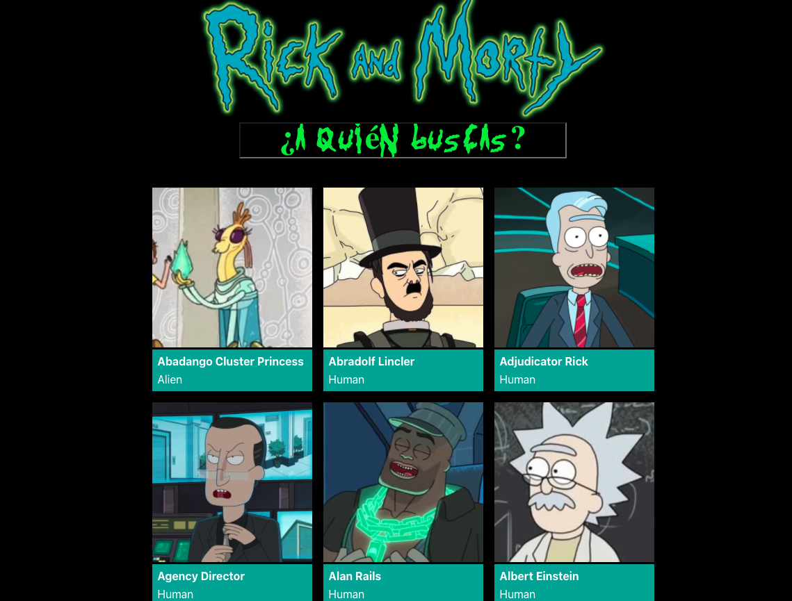
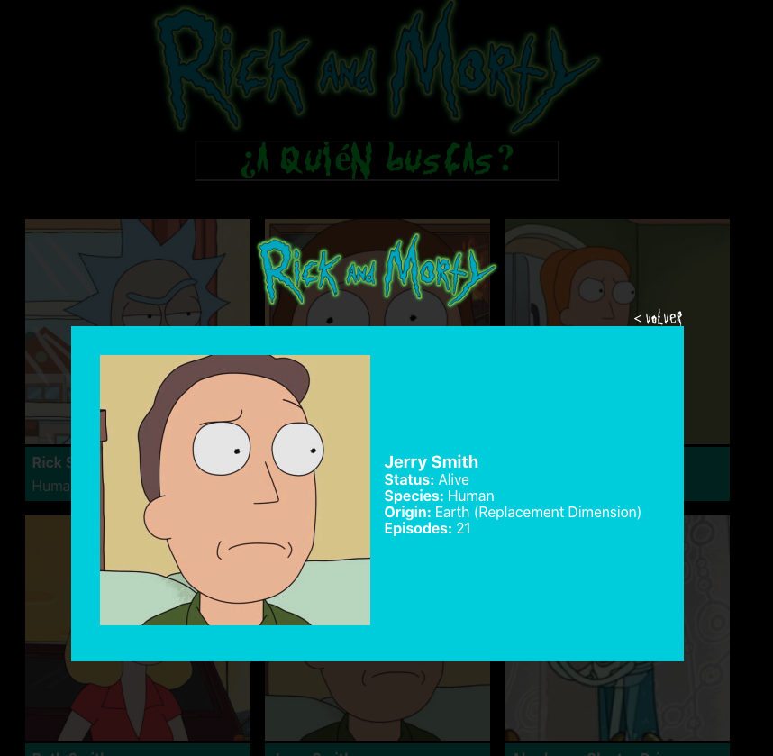

# Rick & Morty Character Finder

Final exercise of Adalab bootcamp. It consists of developing a web page with a list of 'Rick and Morty' characters, which we can filter by the name of the character.

Built with **React, JavaScript, HTML5 and Sass**

## Demo

If you want to see the demo of this project deployed, you can visit the [Demo page](http://beta.adalab.es/modulo-3-evaluacion-final-itziarZG "Take a look")

##

## React APP Tree

```
src
├── App.js
├── _app.scss
├── components
│   ├── CharacterCard
│   │   ├── CharacterCard.js
│   │   └── CharacterCard.scss
│   ├── CharacterDetail
│   │   ├── CharacterDetail.js
│   │   ├── CharacterNotFound.js
│   │   ├── Details.js
│   │   └── CharacterDetail.scss
│   ├── CharacterList
│   │   ├── CharacterList.js
│   │   └── CharacterList.scss
│   ├── Filters
│       ├── Filters.js
|       ├── FilterEmpty.js
│       └── FilterEmpty.scss
│
├── index.js
├── index.scss
|── services
|   └── getDataFromAPI.js
|   └── Loader.js
|   └── Loader.scss
├── fonts
|   └── get_schwifty.ttf
├── images
    └── background.jpg
    └── Rick_and_Morty-logo.png
```

---

### My website

My website looks like this:


You can filter by name and see more details of the character you want.


---

## Available Scripts

This project was bootstrapped with [Create React App](https://github.com/facebook/create-react-app).
In the project directory, you can run:

### `npm start`

Runs the app in the development mode.\
Open [http://localhost:3000](http://localhost:3000) to view it in the browser.

The page will reload if you make edits.\
You will also see any lint errors in the console.

### `npm run build`

Builds the app for production to the `build` folder.\
It correctly bundles React in production mode and optimizes the build for the best performance.

The build is minified and the filenames include the hashes.\
Your app is ready to be deployed!

See the section about [deployment](https://facebook.github.io/create-react-app/docs/deployment) for more information.


---

### Special thanks to my teachers Miguel, Iván & Dayana.

### More specials thanks to all my classmate, specially Irene, now friends!

### And more and more specials thanks to my family, thanks to be patient these days

---

⌨️ with ❤️ by [Itziar Zameza García](https://github.com/itziarZG "Itziar Zameza García") 😊
